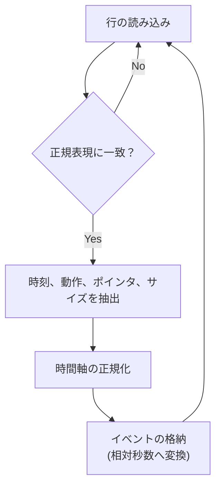

# Python 可視化スクリプト詳細設計書 (visualize.py)

## 第1章 概要と目的

### 1.1 目的とスコープ

本ツールは、透過的フックライブラリ（libvmm\_hook.so）の内部動作を可視化することを目的に開発された。
VMM (Virtual Memory Management) が引き起こすメモリ空間の動的な変化や、ゼロコピーリマップが成功した際のイベントを時系列で描画し、ライブラリの堅牢性と性能特性を検証するための分析基盤を提供する。

* **対象データ**: C++ ライブラリが出力する構造化されたログファイル。
* **成果物**: 仮想アドレス空間の確保・解放のライフサイクルを示す PNG形式のタイムライングラフ。

### 1.2 想定環境と依存関係

本スクリプトは、以下の環境およびライブラリに依存する。

| 項目 | 要件 | 備考 |
| :--- | :--- | :--- |
| **言語環境** | Python 3.x | 標準。 |
| **グラフ描画** | Matplotlib | 矩形（Rectangle）オブジェクトを用いたタイムライン描画に使用。 |
| **データ解析** | re (Regex), argparse | ログファイルのパースとコマンドライン引数の処理に使用。 |

---

## 第2章 データ仕様とパースロジック (Data Specification and Parsing)

### 2.1 入力ログフォーマットの厳密な定義

本ツールの入力は、C++ ライブラリが出力する以下の固定フォーマットのテキストログに厳密に依存する。

| フィールド | 例 | 内容 | 目的 |
| :--- | :--- | :--- | :--- |
| **`[TIME]`** | `[14:30:05.123]` | イベント発生時刻（ミリ秒精度）。 | 時間軸（X軸）の基準点および計算に使用。 |
| **`[LEVEL]`** | `[INF]` / `[DBG]` | ログの重要度。 | 出力制御用。グラフ化時は `[INF]` 以上を対象とする。 |
| **`[ACTION]`** | `ALLOC`, `FREE`, `REMAP`, `COPY` | イベント種別。グラフ描画のトリガーとなるキー。 |
| **`Ptr=`** | `0x904000000` | 操作対象の仮想アドレス。 | グラフの Y軸（アドレス空間）データ。 |
| **`Size=`** | `1073741824` | 操作対象のサイズ（バイト）。 | グラフの矩形サイズ（高さ）。 |

### 2.2 パース処理と時間軸の正規化

ログファイルは、`parse_log()` 関数によって以下の手順で構造化される。



* **時間軸の正規化**: ログファイル内で最初に読み込まれた時刻を基準（$T_0$）とし、以降の全イベント時刻を相対秒数に変換する。これにより、ログの記録時刻に依存しない正確な処理間隔が測定可能となる。
* **データモデル**: パースされたデータは、Python 内部で以下を含む辞書のリストとして保持される。
    * `'time'`: 相対秒数（X軸）。
    * `'ptr'`: 仮想アドレス（Y軸）。
    * `'size'`: 確保サイズ（矩形の高さ）。
    * `'action'`: イベントタイプ（描画ルール適用）。

---

## 第3章 描画アルゴリズムと視覚化設計 (Visualization Design and Algorithm)

### 3.1 メモリタイムラインの基本表現

本可視化ツールは、メモリ領域を **Matplotlib の `patches.Rectangle` オブジェクト** として表現する。これにより、メモリのライフサイクルが直感的に理解できる。

* **X軸 (期間)**: イベントの発生時刻から解放時刻までの期間。
* **Y軸 (位置)**: 仮想アドレスの値。
* **高さ (サイズ)**: 確保されたメモリ量（バイト）。

### 3.2 矩形描画とライフサイクルアルゴリズム

`plot_timeline()` 関数は、イベントの `'action'` に基づいて以下の描画ロジックを実行する。

| イベント (`ACTION`) | 処理ロジック | 描画結果 |
| :--- | :--- | :--- |
| **`ALLOC`** | 該当ポインタを **`active_allocs`** リストに登録し、矩形の開始時刻 (`start_time`) を記録する。 | 矩形の左端を特定。 |
| **`FREE`** | `active_allocs` からポインタを検索し、`start_time` から `current_time` までの幅を持つ閉じた矩形として描画し、リストから削除する。 | 確保期間が完了したメモリブロック。 |
| **`REMAP`** | ゼロコピーによる最適化が発生したことを示す。該当ブロックの位置に、**特殊な色（赤）** の注釈を付与する。 | 性能向上ポイントの視覚的強調。 |
| **終了時** | `active_allocs` に残っているポインタは、テスト終了時刻まで幅を広げて描画し、メモリリークではない「生存中のブロック」として表現する。 | グラフの右端まで続くブロック。 |

### 3.3 アドレス空間の処理とスケーリング

ポインタ値 (`Ptr=`) は巨大な 64bit 整数であるため、グラフの可読性を確保するためのスケーリング処理を行う。

1.  **オフセット処理**: 全イベントの最小アドレスを検出し、その値をオフセットとして使用することで、Y軸の表示範囲を狭め、各ブロック間の相対的な位置関係を強調する。
2.  **スケーリング**: `matplotlib` が自動的に科学表記法（例: `3.0e10`）を適用し、巨大なアドレス空間を圧縮して表示する。

---

## 第4章 実装詳細と実行仕様 (Implementation Details and Usage)

### 4.1 モジュールの責務

スクリプトは、以下の主要な機能に責務を分離する。

* **`parse_log(filepath)`**: ログファイル読み込みと構造化イベントリストの生成を担当。
* **`plot_timeline(events, output_name)`**: `matplotlib` を使用したグラフ描画ロジックを担当。
* **`main`**: コマンドライン引数の処理と、モジュールの実行順序制御を担当。

### 4.2 実行インターフェース

本ツールは、コマンドライン引数としてログファイルパスと出力ファイル名を受け取る。

```bash
# 実行例
python3 tools/visualize.py [LOG_FILE_PATH] [OUTPUT_PNG_FILENAME]
```

このインターフェースにより、`run_tests.sh` などの外部スクリプトから簡単にパイプラインに組み込み、自動的に比較グラフ（`graph_monitor.png` vs `graph_vmm.png`）を生成することが可能である。