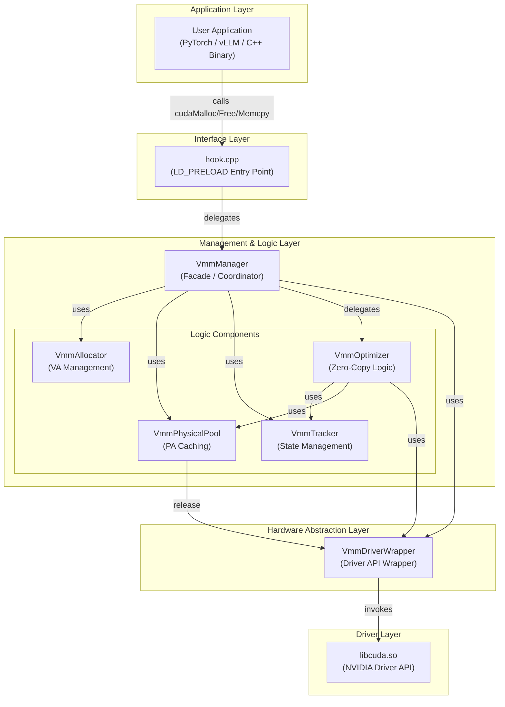
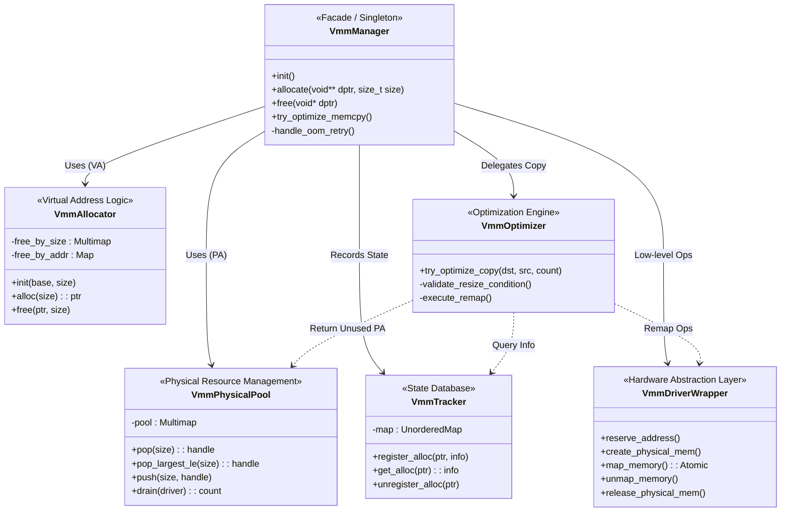
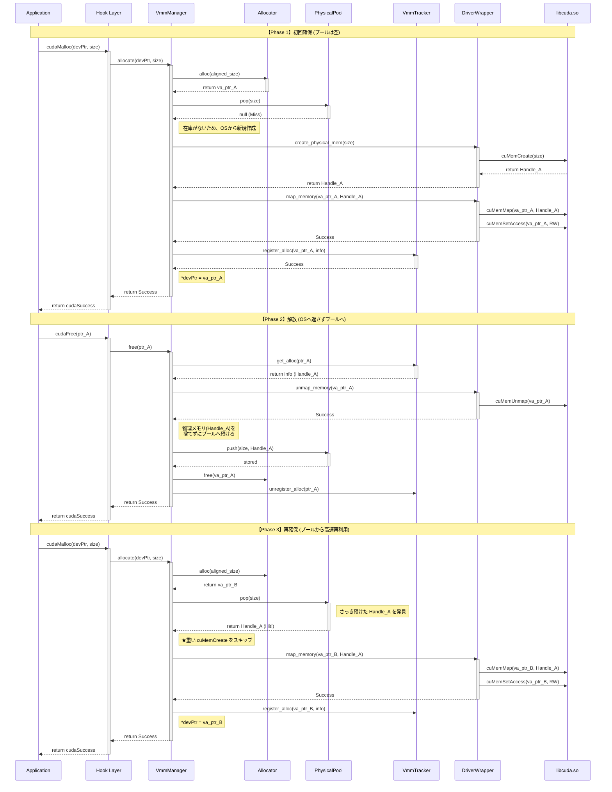
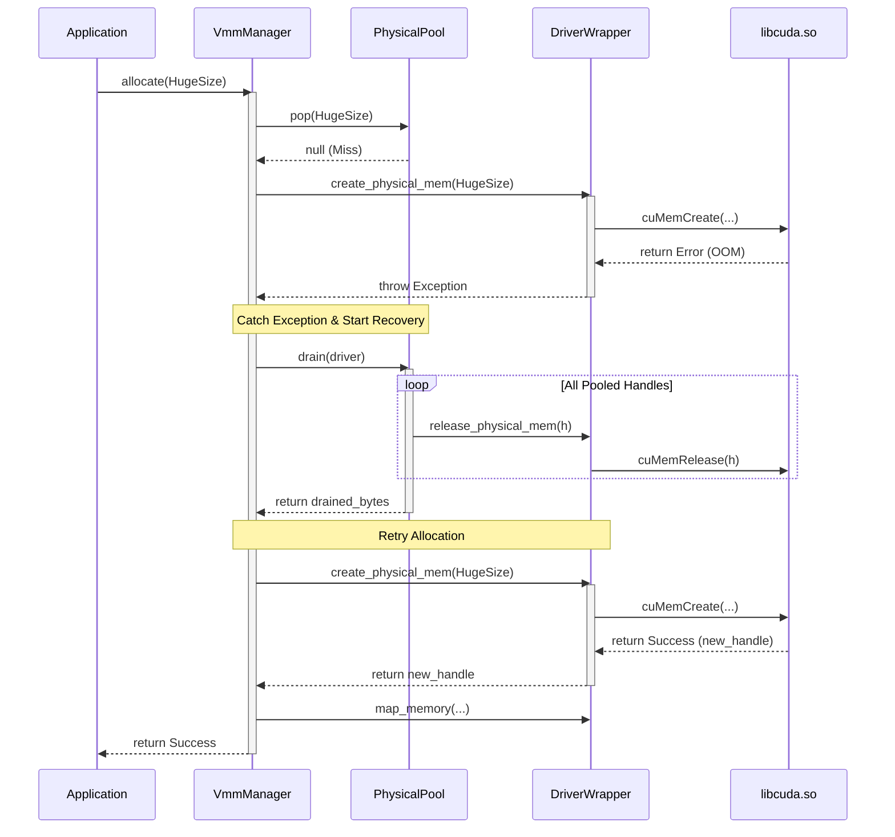
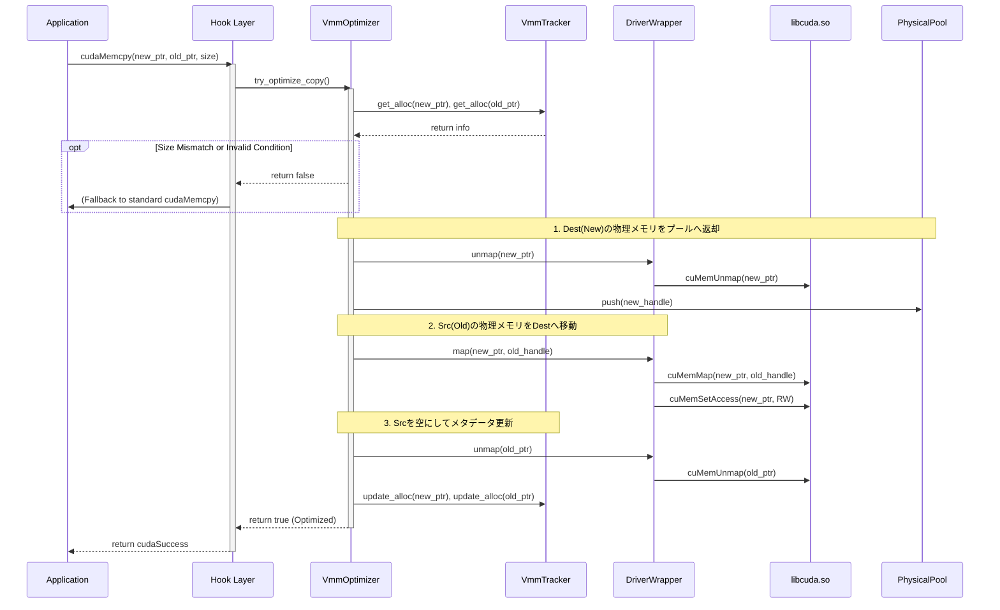

## 第2章　システムアーキテクチャ：全体構造と責務

### 2.1 全体アーキテクチャ：レイヤー構造とコンポーネント相関

本システムは、アプリケーションと GPU ドライバの間に介在し、メモリ管理ロジックを透過的に差し替えるミドルウェアとして動作する。

保守性と拡張性を担保するため、全体を「アプリケーション層」「インターフェース層」「マネジメント層」「抽象化層（HAL）」の4階層に分離したアーキテクチャを採用している。

各コンポーネントの相関図を以下に示す。

#### 各レイヤーの役割定義

1.  **Application Layer (ユーザー領域)**
    * 既存の CUDA アプリケーションそのものである。
    * 本ライブラリの存在を一切認識せず、標準の CUDA Runtime API (`libcudart.so`) に対して関数呼び出しを行う。

2.  **Interface Layer (フック領域)**
    * **`hook.cpp`**: システムのエントリポイントである。
    * `LD_PRELOAD` 機構により、アプリケーションからの API 呼び出しを捕捉（Intercept）する。
    * 環境変数 (`VMM_MODE`) を確認し、VMM モードであればマネジメント層へ処理を委譲し、Monitor モードであれば標準 API へパススルーする振り分けを行う。

3.  **Management & Logic Layer (中核ロジック領域)**
    * **`VmmManager`**: システム全体の司令塔（ファサード）である。各コンポーネントの初期化順序制御や、例外発生時のリカバリ（リトライロジック）を統括する。
    * **Logic Components**:
        * **`VmmAllocator`**: 仮想アドレス空間（VA）の切り出しと結合を管理する。Dual-Tree 構造により $O(\log N)$ の高速探索を実現する。
        * **`VmmPhysicalPool`**: 物理メモリハンドル（PA）をキャッシュし、再利用を管理する。
        * **`VmmTracker`**: ポインタごとのメタデータ（サイズ、ハンドル、VA/PAの状態）を管理するデータベースである。
        * **`VmmOptimizer`**: `cudaMemcpy` を監視し、条件を満たした場合にデータ移動を物理メモリのリマップ（Remap）に置き換える最適化エンジンである。

4.  **Hardware Abstraction Layer (HAL / 抽象化領域)**
    * **`VmmDriverWrapper`**: 複雑な CUDA Driver API (`cuMem*` 系) を隠蔽するラッパーである。
    * エラーハンドリングの統一、ログ出力、および `SetAccess` 失敗時のアトミックなロールバック処理（Atomic Map）を担当し、上位層にクリーンなインターフェースを提供する。

### 2.2 主要コンポーネントの責務定義

本システムを構成する各クラスは、単一責任の原則（SRP）に基づき、その責務が明確に分離されている。
各コンポーネントが持つ主要な機能（メソッド）と、依存関係を以下のクラス図に示す。

#### 1. VmmManager (Facade / Coordinator)
システム全体の司令塔であり、外部（Hook）に対する唯一の窓口となるシングルトンクラス。

* **初期化制御**: `lazy initialization` パターンを用い、最初の API 呼び出し時に一度だけドライバ初期化と VA プールの予約を行う。
* **処理の委譲**: 実際のメモリ操作ロジックは持たず、確保要求は `Allocator` と `Pool` へ、コピー要求は `Optimizer` へと適切にディスパッチする。
* **リカバリ制御**: メモリ確保失敗（OOM）を検知した際、`Pool.drain()` を呼び出してガベージコレクションを実行し、リトライループを回す「自律回復」の責任を持つ。

#### 2. VmmAllocator (Virtual Address Logic)
仮想アドレス空間（VA）の論理的な管理に特化したクラス。物理メモリの状態には関与しない。

* **広大な空間の管理**: 初期化時に予約された巨大な VA プール（例: 16GB〜）を管理対象とする。
* **高速な探索と結合**: `std::map` を用いた Dual-Tree 構造（サイズ別・アドレス別）により、空きブロックの検索（Best-Fit）と、解放時の隣接ブロック結合（Coalescing）を計算量 $O(\log N)$ で実行する。これにより、長時間稼働による断片化時の性能劣化を防ぐ。

#### 3. VmmPhysicalPool (Physical Resource Management)
物理メモリハンドル（PA）のキャッシングとライフサイクル管理を担当するクラス。

* **ハンドルの再利用**: 解放された物理メモリを即座に破棄せず保持し、次回の確保要求時に適合するサイズがあれば提供する。
* **スキャッター・ギャザー支援**: 要求サイズを満たすために、プール内の断片化された小さなハンドルをかき集める（Scatter-Gather）ための検索機能を提供する。
* **断片化フィルタ (Fragment Ratio)**: 環境変数 `VMM_FRAG_RATIO` に基づき、要求サイズに対して小さすぎる断片の使用を拒否し、管理テーブルの肥大化を防ぐ判断を行う。
* **緊急解放 (Drain)**: OOM 発生時に、保持している全てのハンドルをドライバ経由で解放し、VRAM を OS に返却する。

#### 4. VmmOptimizer (Optimization Engine)
`cudaMemcpy` を監視し、データ移動の最適化判断と実行を行う頭脳となるクラス。

* **ゼロコピー判定**: 転送元・転送先の管理情報を照会し、リサイズ（`user_size` の一致など）であるかを厳密に判定する。
* **Remap 実行**: データコピーを行わず、転送元の物理ハンドルを転送先の仮想アドレスにマッピングし直す（Remap）。
* **資産の保全**: 転送先が新規確保されたばかりの領域である場合、そこに紐付いていた物理メモリを破棄せず `Pool` へ返却し、次回の再利用に回すことでオーバーヘッドを最小化する。

#### 5. VmmTracker (State Database)
アプリケーションが扱う「ポインタ（`void*`）」をキーとし、そのメモリ領域の詳細情報を管理するデータベース。

* **メタデータ管理**: 以下の3つの異なる「サイズ」を正確に記録・保持する。
    * `va_size`: 仮想アドレスとして消費しているサイズ（解放時に Allocator へ返す値）。
    * `mapped_size`: 現在物理メモリが割り当てられているサイズ（ドライバ操作用）。
    * `user_size`: アプリケーションが要求した本来のサイズ（最適化判定用）。
* **排他制御**: マルチスレッド環境からのアクセスに対し、一貫性を保証する。

#### 6. VmmDriverWrapper (Hardware Abstraction Layer)
複雑かつ危険な CUDA Driver API (`cuMem*` 系) を隠蔽し、安全なインターフェースを提供するラッパー。

* **API の隠蔽**: `cuMemAddressReserve`, `cuMemCreate`, `cuMemMap` などの低レイヤ操作をカプセル化する。
* **Atomic Map**: `cuMemMap` 成功後に `cuMemSetAccess` が失敗した場合、自動的に `cuMemUnmap` を行って状態をロールバックし、不整合（`invalid argument` の原因）を残さないアトミックな操作を保証する。
* **詳細ロギング**: 全てのドライバ操作における引数（ポインタ、サイズ、ハンドル値）と結果をログに出力し、デバッグ可能性を担保する。

### 2.3 処理フロー：APIコールのライフサイクル

本システムにおける主要な3つのユースケースについて、コンポーネント間の相互作用と、**ポインタ変数の操作** および **呼び出される具体的なドライバ API** を定義する。

#### 1. 物理メモリの生成と再利用 (Lifecycle: Create -> Pool -> Reuse)
アプリケーションが `cudaMalloc` と `cudaFree` を繰り返す際、ライブラリ内部で物理メモリがどのように「資産化（キャッシュ）」され、高速な再利用（Hot Path）へと繋がるかを示す。

`cudaMalloc` は通常、内部で `cuMemAlloc` 等を呼ぶが、本ライブラリはそれを遮断し、自らが管理する仮想アドレス (`va_ptr`) をアプリ側のポインタ変数 (`*devPtr`) に書き込む。

#### 2. OOM検知と自律回復 (OOM Recovery Flow)
リソース枯渇時に発生する `cuMemCreate` や `cuMemSetAccess` のエラーを捕捉し、プールを緊急解放（Drain）してリトライするフローである。

#### 3. ゼロコピー・リサイズ (Zero-Copy Optimization Flow)
`cudaMemcpy` をフックし、データ移動を行わずに物理メモリの所有権を移譲する最適化フローである。
`cudaMemcpy` は本来データを転送するだけの API だが、本ライブラリでは「アドレス空間の再構成」を行うトリガーとして機能する。

