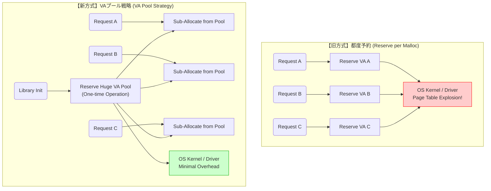
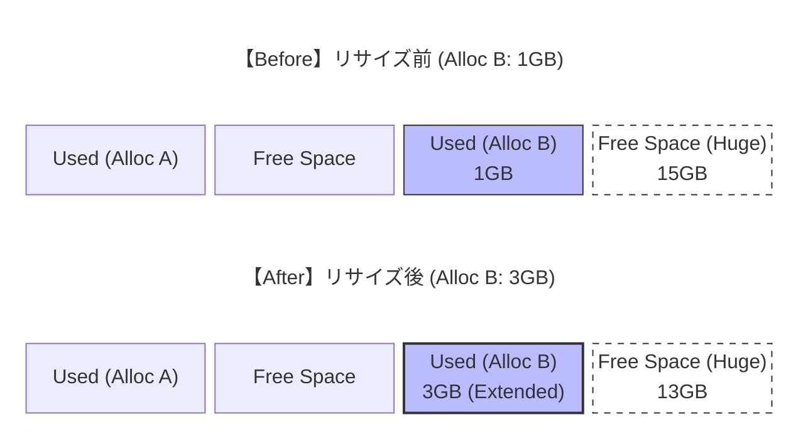
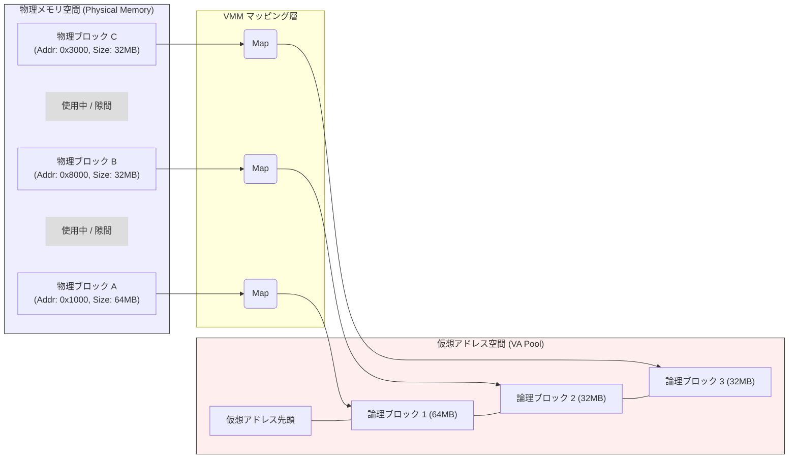
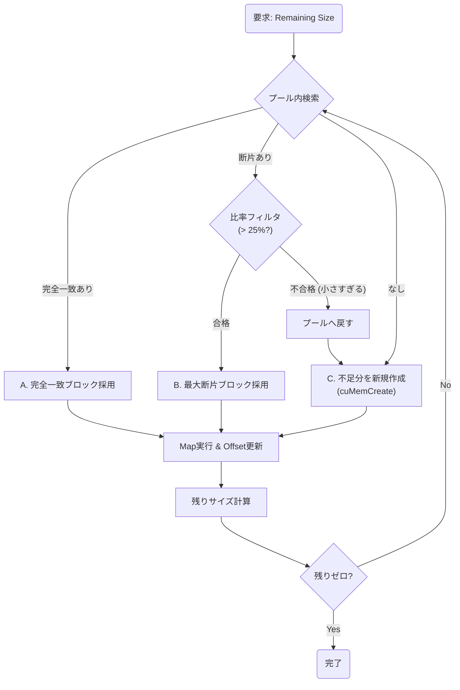
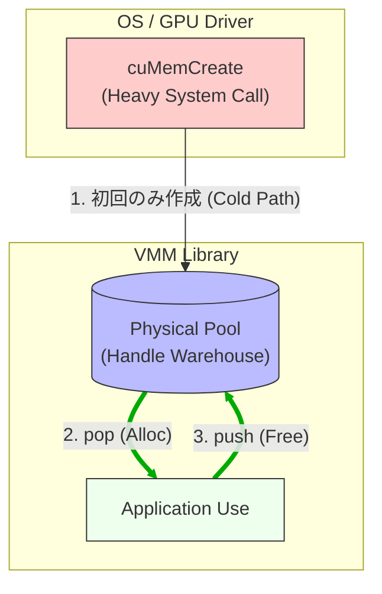
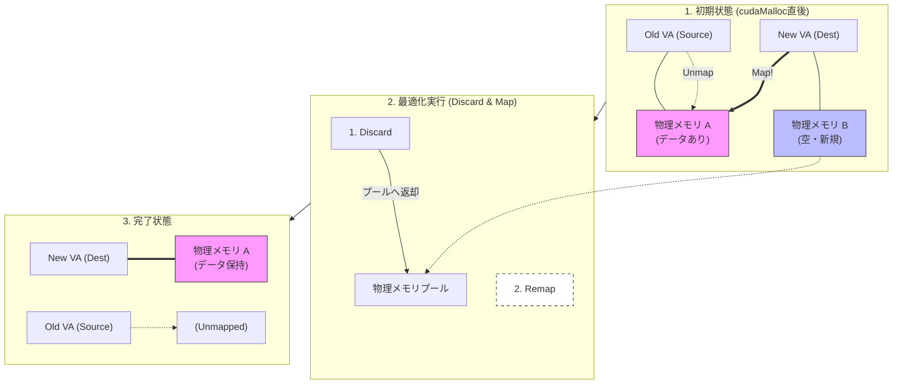
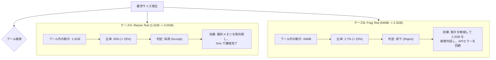

## 第3章　コアロジック詳解：VMMによるメモリ仮想化

### 3.1 仮想アドレスプール戦略 (VA Pool Strategy)

本ライブラリにおけるメモリ管理の根幹を成すのが、**「仮想アドレスプール (VA Pool)」** による空間管理戦略である。
これは、アプリケーションからの要求ごとに OS へアドレス空間を問い合わせるのではなく、初期化時に「広大な更地」を一括して借り上げ、ライブラリ内部で切り盛りする手法である。

#### 1. 戦略の概要：都度予約から一括予約へ
従来の Runtime API や、単純な Driver API の実装では、メモリ確保のたびに OS (Driver) に対して仮想アドレスの予約 (`Reserve`) を行っていた。しかし、本ライブラリでは以下の戦略を採用している。

* **初期化時**: 物理 VRAM 容量の数倍〜数十倍（例: 16GB 〜 128GB）にあたる巨大な仮想アドレス空間を、**たった1回の API コール** で一括予約する。
* **確保時**: アプリケーションからの `malloc` 要求に対しては、この予約済みプールの中から「空いている区画（オフセット）」を切り出して割り当てる。

この構造の違いを以下の図に示す。

#### 2. なぜプールが必要なのか：2.6TB 問題の教訓
開発段階の `Fragmentation Test` において、小さなメモリ（64MB）を大量（81回）に確保した際、システム全体が応答不能に陥る現象が発生した。
分析の結果、都度予約方式では、小さな確保のたびに将来の拡張を見越して巨大な VA 枠（32GB）を予約していたため、合計で **2.6TB** もの仮想アドレスを消費していたことが判明した。

この教訓から、以下の技術的制約が明らかとなった。

* **OS 管理領域の枯渇**: `cuMemAddressReserve` は物理メモリ（VRAM）を消費しないが、**ホストメモリ（RAM）上のページテーブルや管理ハンドル** を消費する。無尽蔵な予約はホストメモリを圧迫し、OS のスラッシングを引き起こす。
* **WDDM の制限**: 特に Windows (WSL2) 環境では、GPU ドライバが管理できるリソースハンドル数に厳格な上限があり、多数の小規模な `Reserve` はこれに抵触しやすい。

VA プール戦略は、OS に対する `Reserve` 発行回数を「1回」に固定することで、これらの問題を根本から解決した。

#### 3. 方式比較
「都度予約（従来）」と「VAプール（本ライブラリ）」の特性比較を以下に示す。

| 比較項目 | 都度予約 (Reserve per Malloc) | VAプール戦略 (VA Pool Strategy) |
| :--- | :--- | :--- |
| **OS/ドライバ負荷** | **高 (High)** 確保回数に比例してシステムコールと管理テーブルが増大する。 | **最低 (Low)** 初期化時の1回のみ。以降はユーザー空間でのポインタ計算のみで完結する。 |
| **アドレスの連続性** | **断続的 (Fragmented)** 予約領域同士の間に隙間ができやすく、後からそれらを結合することは不可能。 | **完全連続 (Contiguous)** 単一の巨大な空間であるため、隣接するブロック同士は常に結合可能であり、断片化に強い。 |
| **拡張性 (Scalability)** | **限定的** 隣接アドレスが空いている保証がないため、リサイズ時の拡張が失敗しやすい。 | **無限大** VRAM 容量を遥かに超えるサイズ（16GB以上）を予約済みであるため、物理メモリさえあればどこまでも拡張できる。 |
| **Hostメモリ消費** | **爆発的** 確保数 × 予約サイズ分の管理コストがかかる（例: 2.6TB分のテーブル）。 | **定数** プールサイズ（例: 16GB）分の管理コストのみで一定。 |

#### 4. プール内部の論理構造とリサイズ (Before / After)
確保された VA プール内部では、使用中のブロックの隣に常に「巨大な空き地」が維持されている。
アプリケーションが `Alloc B` のリサイズ（拡張）を要求した際、ライブラリは以下の図のように **「隣の空き地へ境界線を動かすだけ」** で対応する。

このように、アドレス（`Alloc B` の左端の位置）を変更することなく、右側の空き領域を飲み込んでサイズを拡大できる。これが、データコピーを発生させない「ゼロコピー・リサイズ」の幾何学的な正体である。

### 3.2 スキャッター・ギャザー機構 (Scatter-Gather Mechanism)

VMM の最大の利点は、**「物理メモリの配置」と「仮想アドレスの配置」を完全に分離できる** 点にある。
本ライブラリは、この特性を最大限に活用し、物理的には不連続（Scatter）なメモリブロックを、仮想アドレス上では完全に連続（Gather）した単一のバッファとしてマッピングする機構を実装している。

#### 1. 物理と仮想の乖離（マッピング構造）
Monitor Mode（Runtime API）では、物理メモリの断片化がそのまま仮想アドレスの断片化に直結していた。
対して VMM Mode では、以下の図に示すように、物理的な位置関係を無視して論理的な結合を行う。

アプリケーションから見ると、`論理ブロック 1〜3` は完全に連続した `128MB` の配列としてアクセス可能である。裏側で物理メモリが飛び地になっていても、ハードウェア（MMU）が透過的にアドレス変換を行うため、パフォーマンスへの悪影響はない。

#### 2. ハイブリッド確保アルゴリズム
`allocate` 関数内部では、要求されたサイズを満たすために、プール内の資源と新規作成を組み合わせる **ハイブリッドなループ処理** が実行される。
このロジックにより、過去のリサイズで発生した「半端なサイズの断片」も無駄なく再利用される。

このアルゴリズムにより、以下の挙動が実現される。

* **優先順位**: まず「プール内の資源」を最優先で消費する。
* **柔軟性**: 1つの巨大な物理メモリが見つからなくても、複数の小さな物理メモリを組み合わせて要求を満たす。
* **効率性**: どうしても足りない分だけを OS に新規要求 (`cuMemCreate`) するため、VRAM の無駄な消費を最小限に抑える。

#### 3. 粒度アライメント (Granularity Alignment)
Driver API を操作する上で避けて通れない制約が **アライメント（粒度）** である。
`cuMemCreate` や `cuMemMap` は、GPU アーキテクチャごとに定められた「最小粒度（Granularity）」の倍数でしか操作できない（通常は 2MB 程度）。

本ライブラリでは、`Hardware Abstraction Layer (VmmDriverWrapper)` から粒度を取得し、以下の調整を自動的に行っている。

* **要求サイズの切り上げ**: アプリが `100MB` を要求し、粒度が `2MB` の場合、物理メモリは `100MB` で確保される。
* **端数処理**: アプリが `101MB` を要求した場合、物理メモリは `102MB` (2MB × 51) 確保される。
* **管理の分離**: `VmmTracker` において、アプリが認識する `user_size (101MB)` と、実際に確保した `mapped_size (102MB)` を別々に管理することで、`cudaMemcpy` 時のサイズ不一致判定などのバグを防いでいる。

### 3.3 物理リソースの「資産化」とキャッシング (Physical Resource Pooling)

本ライブラリが `cudaMalloc` を爆速化できる最大の理由は、物理メモリを「その場限りの使い捨て」から「再利用可能な資産」へと変えた点にある。
第2章のシーケンス図で示した「プール内の在庫」がどのように形成され、循環しているかを定義する。

#### 1. 物理メモリのライフサイクル比較
従来の Runtime API と、本ライブラリ（VMM Pool）における物理メモリの扱い（ライフサイクル）を比較する。

| フェーズ | 従来 (Runtime API) | **本ライブラリ (VMM Pool)** |
| :--- | :--- | :--- |
| **確保 (Alloc)** | 毎回 OS に `cuMemCreate` を要求。 → **重い (数ms〜)** | まずプールを確認。在庫があればそれを使う。 → **一瞬 (数μs)** |
| **利用 (Use)** | アプリが使用。 | アプリが使用。 |
| **解放 (Free)** | 即座に OS に `cuMemRelease` で返却。 → **捨てる (破棄)** | OS には返さず、プールに `push` して保管。 → **資産化 (Cache)** |

#### 2. "Hot Path" の形成
アプリケーションが `malloc` と `free` を繰り返す場合、本ライブラリ内部では以下のような循環（サイクル）が形成される。

1.  **Cold Path (初回)**: プールが空の場合のみ、仕方なく `cuMemCreate` を呼ぶ。これにはコストがかかる。
2.  **Hot Path (2回目以降)**: 一度確保された物理メモリは、アプリが手放しても (`Free`) プールに戻るだけである。次回の `Alloc` 要求には、このプール内のメモリが即座に提供されるため、OS との通信コストがゼロになる。

実験における **「Loop 1 (92ms) → Loop 2 (20ms)」** という劇的な変化は、処理が Cold Path から Hot Path へ移行したことを示している。

---

### 3.4 ゼロコピー・リマップロジック (Zero-Copy Remap Logic)

本ライブラリが達成した「リサイズ性能 8倍高速化」の源泉は、データコピー（$O(N)$）を物理メモリのリマッピング（$O(1)$）に置換する **ゼロコピー・リマップロジック** にある。
通常、データの移動を伴う `cudaMemcpy` を、本ライブラリは「物理メモリの所有権移転」というメタデータ操作へと昇華させる。

#### 1. "Discard & Map" アルゴリズム
アプリケーションがリサイズ（`malloc` -> `memcpy`）を行う際、ライブラリ内部では以下の矛盾が生じる。

1.  `cudaMalloc(New)`: アプリは新規領域を要求する。ライブラリは予測できないため、真面目に物理メモリを確保して割り当てる。
2.  `cudaMemcpy(New, Old)`: ここで初めて「これはリサイズ（データの引き継ぎ）だ」と判明する。

この時点で、`New` には「新品の物理メモリ」、`Old` には「データの入った物理メモリ」が紐付いている。
`VmmOptimizer` は、以下の **"Discard & Map"（破棄と接合）** 手順を実行することで、データの物理移動を回避する。

1.  **Discard (破棄/返却)**: `New` に割り当てられていた「物理メモリ B」は不要となるため、アンマップして即座に **物理プールへ返却 (Push)** する。これにより、一時的なメモリ確保コストは「資産」として次回に繰り越される。
2.  **Remap (付け替え)**: `Old` が保持していた「物理メモリ A（データ入り）」を、`New` の仮想アドレスへマップし直す。
3.  **Cleanup (後始末)**: `Old` の仮想アドレスからマッピングを解除する。これにより `Old` は抜け殻となる。

#### 2. 定数時間 ($O(1)$) の理論的根拠
通常の `cudaMemcpy` と、本手法の計算量（Time Complexity）比較を以下に示す。

| 処理フェーズ | 通常の Runtime API | VMM Zero-Copy |
| :--- | :--- | :--- |
| **確保 (Alloc)** | $O(1)$ (Pool利用時) | $O(1)$ (Pool利用時) |
| **転送 (Copy)** | **$O(N)$** データサイズ $N$ に比例して、GPU のメモリ帯域幅を消費しながら全ビットを転送する。 例: 3GB なら約 140ms。 | **$O(1)$** データサイズに関わらず、OS のページテーブルエントリを書き換えるだけである。 例: 3GB でも 3TB でも数マイクロ秒。 |
| **解放 (Free)** | $O(1)$ | $O(1)$ |

グラフで確認された「バーの位置が変わらず長さだけ伸びる」現象は、このロジックにより「物理メモリ A」がその場に留まり続け、仮想アドレスの窓だけが `Old` から `New` へと切り替わった結果である。

#### 3. 拡張（Extend）への対応
リサイズによってサイズが増加する場合（例: 1.5GB -> 3.0GB）、`Optimizer` は以下の複合操作を行う。

1.  **Remap**: 既存の 1.5GB 分を `Old` から `New` へ移す。
2.  **Extend**: 不足分の 1.5GB をプールから取得（または新規作成）し、`New` の後半部分に継ぎ足す（Mapする）。

これにより、ユーザーは「データの維持」と「領域の拡張」を同時に、かつコストゼロで享受することができる。

### 3.5 断片化比率フィルタ (Fragment Ratio Filter)

スキャッター・ギャザーは強力な機能であるが、無制限な断片利用は新たなボトルネックを生む。「塵も積もれば山となる」が、GPU ドライバにおいて「塵（極小の断片）」を大量に積むことは、管理テーブルの爆発と API エラー（`MemSetAccess: out of memory`）を招く危険な行為である。

本ライブラリは、**「断片化比率フィルタ (Fragment Ratio Filter)」** を導入することで、再利用の効率性とシステム負荷のバランスを動的に制御している。

#### 1. "ゴミ" を定義するトレードオフ
物理メモリプール内に存在する空きブロック（断片）を再利用する際、以下のトレードオフが存在する。

* **再利用のメリット**: 新規確保（`cuMemCreate`）のコストを回避できる。VRAM 使用量を節約できる。
* **再利用のリスク**: 要求サイズに対して極端に小さな断片を大量にかき集めると、マッピング回数と管理ハンドル数が激増し、OS/ドライバのリソース制限を超過する。

`Fragmentation Test` における失敗事例では、2.3GB の要求に対し、プール内の 64MB の断片（約2.7%）を数十個結合しようとしてドライバがパンクした。これを防ぐには、**「小さすぎる断片は、今回の巨大な要求には使わない（無視する）」** という判断が必要となる。

#### 2. フィルタリング・アルゴリズム
`allocate` 処理において、プールから断片を取得した際、以下の判定ロジックを実行する。

$$
\text{If } (\text{FragmentSize} < \text{RequestSize} \times \text{Threshold}) \rightarrow \text{Reject}
$$

* **Threshold (閾値)**: 環境変数 `VMM_FRAG_RATIO` で指定（デフォルト **0.25** = 25%）。
* **挙動**:
    * **Reject (却下)**: 取得した断片はプールに戻し、使用しない。不足分は新規作成で賄うことで、ハンドルの総数を抑える。
    * **Accept (採用)**: 断片をマッピングに使用する。

#### 3. 挙動の分岐シナリオ
このフィルタにより、アプリケーションの要求パターンに応じて、ライブラリは自動的に最適な戦略を選択する。

* **ケースA (有効な再利用)**: リサイズ時のような「意味のある大きさの塊」は積極的に再利用され、爆速化に寄与する。
* **ケースB (有害な再利用)**: 断片化テストのような「細切れのゴミ」は無視され、クリーンな巨大ブロックを新規作成することで、安定性を担保する。却下された小さな断片は、将来の「小さな要求（64MB等）」のためにプールに温存される。

この動的なフィルタリング機構により、本ライブラリは **「パフォーマンス（速度）」と「ロバストネス（安定性）」という相反する要件を、単一のロジックで両立させている。**
