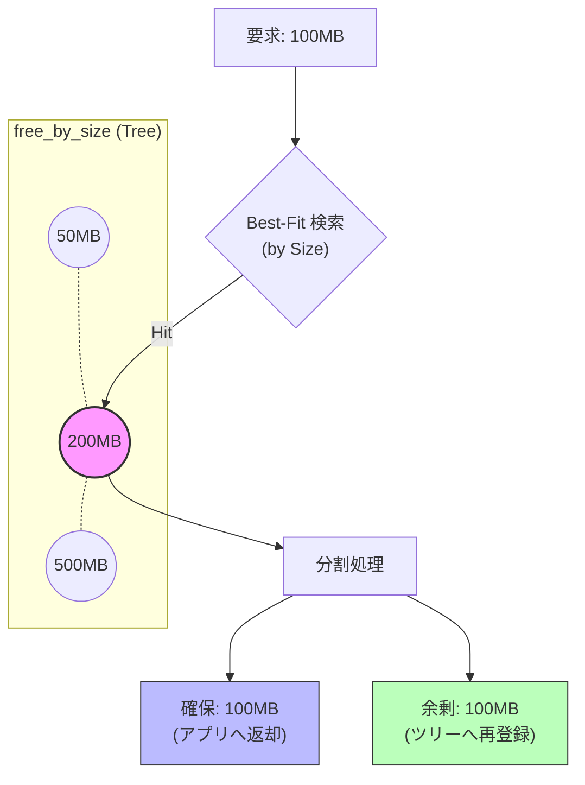
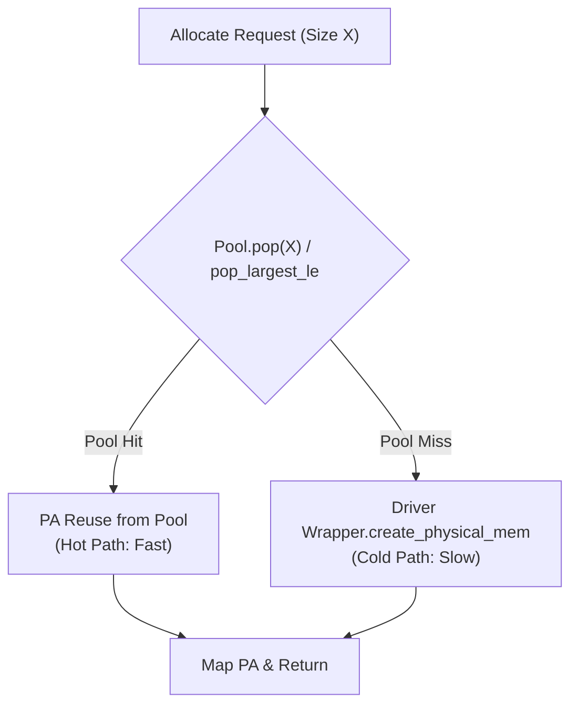

## 第4章　データ構造とリソース管理

### 4.1 メタデータ管理と状態追跡 (VmmTracker)

Driver API を用いた低レイヤメモリ管理においては、Runtime API が隠蔽していた「パラメータの不一致」が致命的なバグ（リソースリークや不正アクセス）に直結する。
`VmmTracker` は、アプリケーションが扱うポインタ（`void*`）をキーとし、その領域に関する詳細なメタデータを一元管理するデータベースである。

#### 1. 「3つのサイズ」の分離管理
本システムでは、1つのメモリ領域に対して **3種類の異なる「サイズ」** を定義し、それぞれ独立して管理している。

| 変数名 | 定義 (Definition) | 目的 (Purpose) | 値の例 (Example) |
| :--- | :--- | :--- | :--- |
| **`user_size`** | アプリケーションが `cudaMalloc` で要求した本来のバイト数。 | **最適化判定**: `cudaMemcpy` 時に「これは全データの移動か？」を厳密に判定するために使用する。<br>ここがズレると最適化が発動しない。 | 100 MB |
| **`mapped_size`** | ドライバの粒度 (Granularity) に合わせて切り上げられ、実際に物理メモリがマップされているサイズ。 | **物理操作**: `cuMemUnmap` や `cuMemSetAccess` など、ドライバ API への引数として使用する。<br>ゼロコピー移動後は `0` に更新される。 | 102 MB<br>(2MB align) |
| **`va_size`** | 仮想アドレスプールから切り出された領域のサイズ。 | **資源返却**: `cudaFree` 時に `VmmAllocator` へアドレスを返却するために使用する。<br>物理メモリが移動して `mapped_size` が 0 になっても、この値は保持される。 | 102 MB |

#### 2. 状態管理データ構造
これらのメタデータは、以下の構造体として `std::unordered_map` に格納される。

```cpp
struct AllocationInfo {
    CUdeviceptr dptr;       // 仮想アドレスの先頭
    size_t va_size;         // [固定] 解放すべきVAサイズ
    size_t mapped_size;     // [可変] 現在マップされている物理サイズ
    size_t user_size;       // [固定] アプリの認識サイズ
    
    // 物理ハンドルリスト (Scatter-Gatherにより複数保持可能)
    std::vector<std::pair<CUmemGenericAllocationHandle, size_t>> handles;
};
```

#### 3. 状態遷移と整合性の保証
`VmmOptimizer` によるゼロコピー・リサイズ実行時、これらの値は以下のように遷移し、整合性を保つ。

1.  **Before (移動前)**:
    * `user_size`: 100MB
    * `mapped_size`: 102MB (物理メモリあり)
    * `va_size`: 102MB
2.  **During (移動中)**:
    * 物理ハンドル (`handles`) を移動先へコピー。
    * 物理マッピング (`Unmap`) を実行。
3.  **After (移動後 = 抜け殻)**:
    * `user_size`: 100MB (記録としては残る)
    * **`mapped_size`: 0** (物理実体なし)
    * **`va_size`: 102MB** (場所としての権利は保持)

この設計により、後の `cudaFree` 呼び出し時に **「物理メモリは解放しない（実体は移動済みだから）」** が、**「仮想アドレスは返却する（場所はもう不要だから）」** という正しい振る舞いが可能となる。


### 4.2 高速空き領域管理アルゴリズム (Dual-Tree Allocator)

仮想アドレスプール（VA Pool）は、数万〜数十万のメモリブロックが混在する巨大な空間となり得る。ここで単純な線形リスト（Linked List）を用いて空き領域を管理した場合、探索コストは $O(N)$ となり、断片化が進むにつれて割り当て速度が致命的に悪化する。

本ライブラリでは、OS のカーネルメモリアロケータ等でも採用される **Dual-Tree（双対木）構造** を実装し、探索と解放（結合）の双方において常に $O(\log N)$ の計算量を保証している。

#### 1. Dual-Tree データ構造
同じ「空きブロック」の集合に対して、目的の異なる2つの平衡二分探索木（C++ `std::map` / `std::multimap`）を用いてインデックスを構築している。

| コンテナ名 | 型定義 (Type) | キー (Key) | 値 (Value) | 目的 (Purpose) |
| :--- | :--- | :--- | :--- | :--- |
| **`free_by_size`** | `std::multimap` | **サイズ**<br>(`size_t`) | アドレス<br>(`ptr`) | **Best-Fit 探索**<br>要求サイズを満たす「最小の空きブロック」を高速に発見する。<br>同じサイズのブロックが複数存在し得るため `multimap` を採用。 |
| **`free_by_addr`** | `std::map` | **アドレス**<br>(`ptr`) | サイズ<br>(`size_t`) | **結合 (Coalescing)**<br>解放されたブロックの「左隣」と「右隣」を高速に特定し、断片化を解消（マージ）する。<br>アドレスはユニークであるため `map` を採用。 |

#### 2. 割り当てロジック (Allocation: Best-Fit)
メモリ確保要求 (`req_size`) が来た際、`free_by_size` ツリーを使用して以下のアルゴリズムを実行する。

1.  **探索**: `lower_bound(req_size)` を使用し、要求サイズ以上である最初のブロック（Best-Fit）を $O(\log N)$ で特定する。
2.  **分割**: 見つかったブロックが要求サイズより大きい場合、余剰分を「新しい空きブロック」として分割し、再びツリーに登録する。
3.  **更新**: 使用する部分をツリーから削除する。



#### 3. 解放と結合ロジック (Deallocation: Coalescing)
メモリ解放時、単に空きリストに戻すだけでは断片化（小さな隙間）が増大する一方である。
`VmmAllocator` は `free_by_addr` ツリーを使用し、**「隣接する空き領域との結合（Coalescing）」** を即座に行う。

* **前方結合**: 解放アドレスの「直前」に空きブロックがあるか確認し、あればマージする。
* **後方結合**: 解放アドレスの「直後」に空きブロックがあるか確認し、あればマージする。


この結合処理により、バラバラに解放された 64MB のブロック群も、最終的には元の巨大な 16GB のブロックへと自然に復元される。これにより、長時間稼働後の巨大確保も失敗することなく成功する。

#### 4. 計算量比較
線形リスト方式と本方式の性能特性比較を以下に示す。ブロック数 $N$ が増大するほど、その差は歴然となる。

| 操作 | 線形リスト (Linear Scan) | **Dual-Tree (本ライブラリ)** |
| :--- | :--- | :--- |
| **探索 (Alloc)** | $O(N)$ (最悪全走査) | **$O(\log N)$** (木探索) |
| **解放 (Free)** | $O(1)$ (末尾追加) | **$O(\log N)$** (挿入+結合) |
| **断片化耐性** | 低 (結合コストが高いため放置されがち) | **高** (常に結合される) |
| **10万ブロック時のコスト** | 非常に重い | **瞬時** |

このアルゴリズムの実装により、本ライブラリはメモリ管理のオーバーヘッドをマイクロ秒オーダーに抑え込み、ドライバ API の高速性を損なうことなく仮想化を実現している。


### 4.3 物理リソースのキャッシング戦略 (Physical Pool)

本システムにおける性能の安定性と高効率性は、**VmmPhysicalPool** が実現する物理メモリのキャッシング機構に依存している。`cuMemCreate` は OS/ドライバとのやり取りが発生するため、低レイテンシ環境においては無視できないコスト（遅延）となる。

Physical Pool は、この高コストな `cuMemCreate` のシステムコールを可能な限り回避し、プール内でのメモリの再利用を促進する責任を持つ。

#### 1. プール構造と再利用ロジック
Physical Pool は、解放された物理メモリハンドル（PA）をサイズ別に分類し、管理している。

| 項目 | データ構造 | 目的 |
| :--- | :--- | :--- |
| **格納** | `std::multimap<Size, Handle>` | サイズ別に格納。同じサイズのハンドルが複数存在可能。 |
| **取得 (`pop`)** | `find()` または `pop_largest_le()` | 要求されたサイズに一致するハンドル、または継ぎ接ぎ（Scatter-Gather）に使用可能な断片を検索する。 |
| **返却 (`push`)** | `insert()` | `cudaFree` や最適化時に放出されたハンドルをプールに戻す。 |

#### 2. リソース獲得フロー (Cold vs. Hot Path)
メモリ確保要求が来た際、システムは以下の優先順位で物理リソースを獲得する。


プールがヒットする **Hot Path** に入ることで、数ミリ秒〜数十ミリ秒かかる `cuMemCreate` のコストが **ゼロ** になる。これは、リサイズテストにおいて2回目以降のループが爆速化（〜10ms台）した主要因である。

#### 3. 緊急解放（Drain）による堅牢性の確保
プールによる積極的なキャッシングは性能を向上させるが、前回の分析で判明したように、VRAM を常に占有し続けるため、OOM のリスクを高める。

* **リスク**: プールが 5GB の断片を抱え込んだ状態で、新たに 2GB の連続確保が必要になった場合、合計 7GB となり VRAM 6GB を超過してクラッシュする。
* **解決**: `VmmManager` が OOM を検知した際、プールに対して **`drain()`** コマンドを発行する。`drain` は保持している全ての物理ハンドルをドライバ (`cuMemRelease`) へ返却し、VRAM を OS に明け渡す緊急ガベージコレクションである。
* **効果**: クリーンな VRAM 状態にリセットされた後、システムはリトライを行う。これにより、VMM は **「積極的なキャッシングによる性能」と「危機時の迅速なメモリ返却による安定性」** という相反する要件を両立させている。
