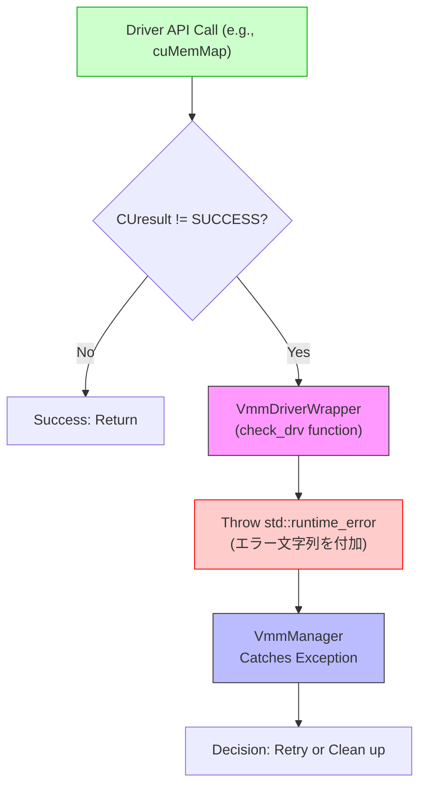
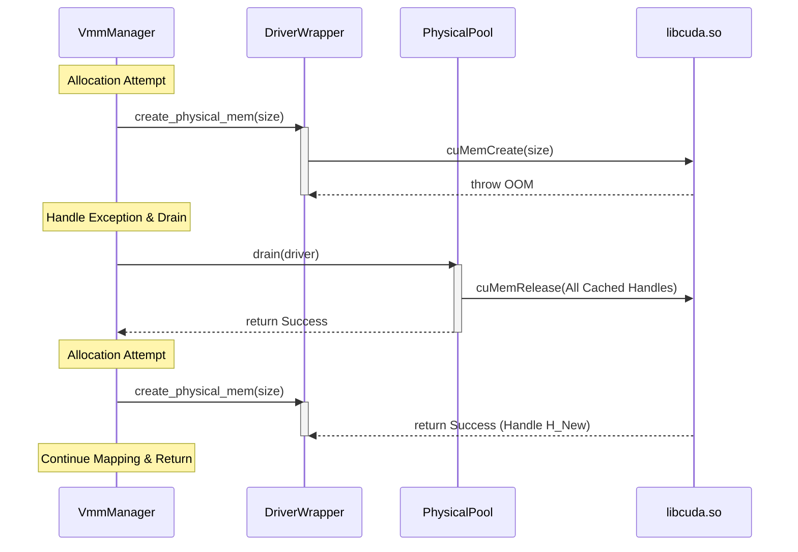
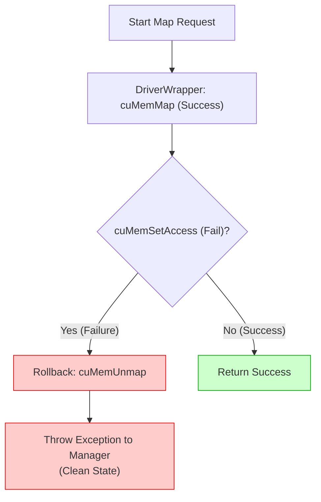

# 第5章　堅牢性設計：エラーハンドリングと自律回復

### 5.1 失敗検知とエラーカスケードの防止

システムの中核である VMM の操作は、CUDA Driver API の `CUresult` という非例外ベースの戻り値に依存している。この低レイヤのエラーを適切に処理し、上位層に伝播させなければ、**システム全体がクラッシュする「カスケード障害」** に発展する危険がある。

本設計では、`VmmDriverWrapper` をエラーの検知フィルターとして機能させ、全ての低レイヤエラーを C++ の例外 (`std::runtime_error`) へと構造的に変換する。

#### 1. エラー変換の原則

すべての Driver API 呼び出しは、`VmmDriverWrapper` 内のラッパー関数を通じて行われ、戻り値が `CUDA_SUCCESS` でない場合、即座に例外をスローする。

| 項目 | 処理内容 | 目的 |
| :--- | :--- | :--- |
| **入力** | `CUresult` (int) | 非構造的なエラーコードを捕捉。 |
| **変換** | C++ `throw std::runtime_error` | 例外発生時のスタック情報やエラー文字列（`cuGetErrorString`）を付加し、エラーを情報豊富なデータとして処理層へ送る。 |
| **フィルタ** | `VmmDriverWrapper` | エラーが上位層へ伝播するのを防ぎ、処理をマネージャー層に一元化する。 |

#### 2. エラー伝播のフロー

エラーが発生してから、自律回復の判断を行うマネージャーに到達するまでのプロセスを図に示す。

#### 3. カスケード防止の重要性

この例外ベースの設計により、以下の堅牢性を担保している。

* **即時停止とロールバックの準備**: エラーが発生した瞬間、処理が即座に中断され、`VmmManager` の `catch` ブロックに制御が移る。これにより、半端な状態での処理続行を防ぎ、安全なロールバック（アンマップ、ハンドル解放など）の機会を確保できる。
* **追跡可能性の向上**: C++ 例外はスタックトレースを持つため、どの API コールのどの行でエラーが発生したかを容易に特定でき、デバッグ性が向上する。

### 5.2 自律的回復（Drain & Retry）機構

本ライブラリが採用する「積極的な物理メモリのキャッシング（Physical Pool）」は性能を最大化するが、同時に VRAM を占有し続けるため、外部からの巨大確保要求に対する OOM リスクを高める。
**Drain & Retry 機構** は、このトレードオフを乗り越えるための自律回復アルゴリズムである。

#### 1. 動作原理：Hoarding (抱え込み) の解消
メモリ確保（`cuMemCreate` や `cuMemSetAccess`）が失敗する際、システムは以下の手順で「抱え込んだ物理メモリ」を解放し、リトライする。

1.  **失敗検知**: `VmmDriverWrapper` から例外 (`OOM`) が送出され、`VmmManager` の `catch` ブロックで捕捉される。
2.  **緊急排出 (Drain)**: `VmmManager` は直ちに `VmmPhysicalPool` に対して `drain()` コマンドを発行する。
3.  **VRAMの回復**: `drain` された `VmmPhysicalPool` は、プール内に保持していた全ての未使用ハンドル（物理メモリ）を `cuMemRelease` によって OS に返却する。これにより VRAM の空き容量が最大化される。
4.  **リトライ**: VRAM が回復した状態で、失敗したメモリ確保操作を再試行する。

この自律的なガベージコレクションにより、アプリケーションは「一時的な OOM」を意識することなく処理を続行できる。

#### 2. 自律回復のフロー

メモリ確保中に OOM が発生し、システムが自律回復する際のシーケンスを図に示す。

#### 3. ロールバックと VA の整合性
リトライに際し、`VmmManager` は **「VA再取得戦略」** を実行する。これは、エラー発生前の VA 空間（汚染されている可能性がある）を `VmmAllocator` に返却し、再試行時には新しいクリーンな VA 空間を取得する。

* **目的**: 以前の失敗で VA 空間内に残ったマップの残骸や、状態不整合による `MemMap : invalid argument` などの致命的なエラーを確実に回避するためである。

この機構により、本ライブラリはハイパフォーマンスなキャッシングの恩恵を受けつつ、プロダクションレベルの堅牢性を実現している。

### 5.3 トランザクション処理と状態不整合の解消

VMM 操作は、`cuMemMap` や `cuMemSetAccess` など複数のドライバコールが連続して実行されるマルチステップ操作である。これらの操作が途中で失敗した場合、システムに**「半端な状態（Partial State）」**が残り、リトライ時や後続の処理で致命的な不整合（例: `MemMap: invalid argument`）を引き起こす。

本システムは、以下の2段階のトランザクション制御により、状態の完全性を保証する。

#### 1. Atomic Map (低レイヤでのロールバック保証)

メモリを仮想アドレスに接続する処理（マッピング）は、「アドレスの紐付け (`cuMemMap`)」と「アクセス権の設定 (`cuMemSetAccess`)」の2ステップで構成される。この処理の原子性を保証するため、`VmmDriverWrapper` 内で以下のロールバック機構を実装している。

* **失敗の捕捉**: `cuMemMap` が成功した後、`cuMemSetAccess` が VRAM 枯渇などの理由で失敗した場合を捕捉する。
* **ロールバック**: `SetAccess` 失敗が確定した瞬間、**成功していた `cuMemMap` の効果を即座に `cuMemUnmap` で打ち消す。**

これにより、上位の `VmmManager` が例外を捕捉する時点では、VRAM 上に不整合なマッピングが残らないクリーンな状態が保証される。

#### 2. Dirty VA Discard (VA汚染の排除)

`VmmManager` レベルでは、リトライ処理の際に以下の設計原則を適用し、不整合を回避する。

* **問題点**: OOM 発生後、リトライ時に前の試行で使った仮想アドレス (`ptr`) を再利用しようとすると、OS/ドライバ側でそのアドレスが「汚染された（Dirty）」と認識され、`invalid argument` エラーが再発する。
* **解決**: リトライが必要になった際、エラーを起こした仮想アドレス (`ptr`) を `VmmAllocator` に `free` で返却し、**次回の試行では必ず `VmmAllocator` から新しいクリーンな仮想アドレスを取得する。**

| 処理 | 従来の誤ったアプローチ | **本設計 (Dirty VA Discard)** |
| :--- | :--- | :--- |
| **リトライ時** | 汚染された VA (`ptr`) を使い回して `map` を再試行する。 | 汚染された VA (`ptr`) を `allocator.free` でプールに返却し、**新しい VA を取得** する。 |
| **効果** | `invalid argument` エラーが永続化する。 | 常にクリーンな VA 空間から処理を開始するため、エラーの再発を防ぐ。 |

この VA 再取得戦略により、本ライブラリは、単なるバグ回避に留まらず、外部環境に起因する状態不整合に対しても極めて高い自律性と回復力を維持する。

### 5.4 スレッド安全性と排他制御

本ライブラリは `LD_PRELOAD` によってアプリケーションのプロセス空間に注入されるため、アプリケーションのスレッド（複数の推論ワーカー、ホストスレッドなど）から `cudaMalloc` や `cudaFree` が同時にコールされる可能性がある。この高い並行性（Concurrency）環境下で、メモリ管理用の共有データ構造の整合性を保つことが、プロダクション利用における必須要件である。

#### 1. データ競合の発生源
データ競合が発生する主要な共有資源は、以下の通りである。

* **VA フリーリスト**: 確保・解放によって内容が頻繁に更新される `VmmAllocator` の Dual-Tree 構造。
* **PA キャッシュ**: 常にハンドルの出し入れが発生する `VmmPhysicalPool` の Multimap 構造。
* **トラッカー**: ポインタ情報を登録/参照/更新する `VmmTracker` の状態データベース。

#### 2. 排他制御の戦略
本設計では、C++ の標準機能である `std::mutex` を用いた **Fine-grained Locking（きめ細かなロック）** 戦略を採用する。

* **粒度**: 各コンポーネント（Allocator, Pool, Tracker）がそれぞれ独自の `std::mutex` を保持し、そのコンポーネントの内部データ構造を操作する直前にのみロックを取得する。
* **目的**: 全体を一つの大きなロックで保護する Coarse-grained Locking を避けることで、異なるコンポーネントへの並行アクセス（例: スレッドAがトラッカーを参照中に、スレッドBがアロケーターを操作する）を許可し、スループットの低下を防ぐ。

#### 3. コンポーネント別ロック責務

排他制御は、RAII (Resource Acquisition Is Initialization) の原則に基づき、`std::lock_guard` を用いて例外安全を確保する。

| コンポーネント | 共有資源 (Shared Resource) | 責務 (Responsibility) |
| :--- | :--- | :--- |
| **VmmTracker** | `std::unordered_map` (状態DB) | ポインタの登録、参照、更新時の整合性（読み書きの保護）。 |
| **VmmAllocator** | Dual-Tree (`free_by_size` / `free_by_addr`) | $O(\log N)$ 探索、分割、結合（Coalescing）時の木構造の整合性保護。 |
| **VmmPhysicalPool** | `std::multimap` (PA Cache) | ハンドル (`pop` / `push`) の出し入れ時のリスト構造の保護。 |
| **VmmManager** | なし (Delegator) | 自身は状態を持たないため、ロックを持たない。下位コンポーネントへのディスパッチに専念する。 |

この排他制御設計により、本ライブラリは複数のスレッドからの API 呼び出しが同時に発生しても、データ競合やメモリ破損を起こすことなく、プロダクションレベルの安定性を維持する。