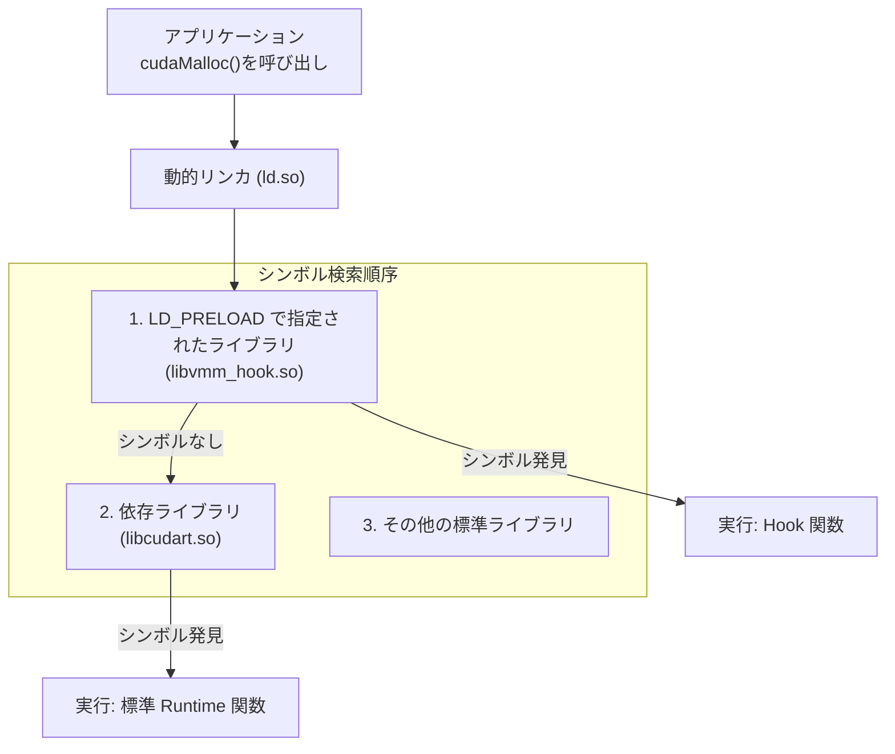

# 第6章　インターフェース仕様：透過的フックの仕組み

### 6.1 透過的インターフェース：LD\_PRELOADの動作原理

本ライブラリの「完全透過性」は、Linux の標準機能である動的リンカの環境変数 **`LD_PRELOAD`** によって実現されている。これは、システムやアプリケーションが標準ライブラリよりも先に、指定された共有ライブラリ（本ライブラリ）をメモリにロードさせるための、強力なシステムフック機構である。

#### 1. シンボル解決の優先順位
Linux の実行ファイルが共有ライブラリの関数（例: `cudaMalloc`）を呼び出す際、動的リンカ (`ld.so`) はメモリ内のシンボル（関数名とアドレスの対応）を検索する。この検索には明確な優先順位が存在する。

`LD_PRELOAD` が設定されている場合、リンカは必ず **本ライブラリの `cudaMalloc` の実装** を `libcudart.so` の標準実装よりも先に発見する。これにより、アプリケーションはオリジナルを呼んでいるつもりでも、実際には本ライブラリ内のフック関数が実行される。

#### 2. 実装上の要件
フックが確実に動作するために、フック対象の関数は以下の要件を満たす必要がある。

1.  **シンボルの一致**: フック関数は、元の関数と**完全に同一の関数名と引数シグネチャ**を持つ必要がある。
2.  **Cリンケージ**: C++ で実装する場合、リンカが C 言語の標準的なシンボル解決規則を使用するよう、**`extern "C"`** で関数を囲む必要がある。
3.  **オリジナルへのアクセス**: フック関数内では、`dlsym(RTLD_NEXT, "関数名")` を使用して、フックした後のオリジナルの関数ポインタを取得し、必要に応じて呼び出せるように設計する。

#### 3. 透過性の担保
この機構により、本ライブラリは以下の二重の透過性を実現している。

* **外部透過性**: アプリケーションのバイナリを一切変更する必要がない。
* **内部透過性**: アプリケーションが `cudaMalloc` を呼んだ際、それが VMM の複雑なロジックに置き換わっていることを意識させない。

この `LD_PRELOAD` によるフックは、続く各章の高度な VMM ロジックが外部に対して非侵襲的に機能するための、最も重要な土台である。

### 6.2 外部設定仕様：環境変数による動作制御

本ライブラリは `VmmEnv` クラスを通じて、起動時にOSの環境変数を読み込み、動作モードや内部アルゴリズムのパラメータを設定する。これにより、外部ユーザーはバイナリに触れることなく、システムの挙動を柔軟にチューニングできる。

#### 1. 動作モードの定義 (VMM_MODE)

本ライブラリの核となる動作を切り替えるための設定である。

| 環境変数 | 値 | 動作 | 目的 |
| :--- | :--- | :--- | :--- |
| **VMM_MODE** | `VMM` (Default) | **透過的最適化** | VMM機構を有効化し、ゼロコピーリサイズ、Pool再利用、OOM回復などの全ての機能を作動させる。 |
| | `MONITOR` | **計測/パススルー** | 標準の `cudaMalloc` を実行しつつ、その前後でメモリ確保・解放のログのみを取得する。最適化前のベースライン性能測定に使用する。 |

#### 2. チューニングパラメータ

システムの安定性と性能に直接影響を与えるヒューリスティックなパラメータ群である。

| 環境変数 | 単位/形式 | デフォルト値 | 目的と効果 |
| :--- | :--- | :--- | :--- |
| **VMM_RESERVE_SIZE_MB** | MB (整数) | 4096 (4GB) | **VAプールサイズ**。初期化時に確保する仮想アドレス空間の総量。Frag Test の成功には、テスト要求サイズ以上の設定が必須である。 |
| **VMM_FRAG_RATIO** | 比率 (0.0〜1.0) | 0.25 | **断片利用の許容しきい値**。要求サイズに対してこの比率未満の小さな物理断片は「ゴミ」とみなし、再利用を拒否して新規作成にフォールバックする。過剰な Scatter-Gather によるドライバの管理リソース枯渇（OOM）を防ぐ。 |

#### 3. 監視・デバッグ設定

システムの動作状況を記録し、解析ツール（`visualize.py`）へのデータ連携を可能にするための設定である。

| 環境変数 | 値 | 責務 |
| :--- | :--- | :--- |
| **VMM_LOG_LEVEL** | `ERROR`, `INFO`, `DEBUG` | **ログ出力の粒度**。`INFO` はグラフ化に必要な最小限の情報（ALLOC, FREE, REMAP）を記録する。`DEBUG` は内部状態の追跡に使用する。 |
| **VMM_LOG_FILE** | ファイルパス | ログの出力先。設定しない場合は標準エラー出力 (stderr) に出力される。 |

### 6.3 監視・デバッグ機能：ロギングレベルと出力フォーマット

本ライブラリは、内部動作を透明化し、デバッグおよび性能解析を可能にするため、専用のロギング機構 (`VmmLogger`) を有する。ログは、Python ツール (`visualize.py`) によるグラフ化を前提とした固定フォーマットで出力される。

#### 1. ロギングレベルの定義
システムは、環境変数 `VMM_LOG_LEVEL` に基づき、以下の3段階で出力を制御する。

| レベル名 | 略称 | 目的と出力内容 |
| :--- | :--- | :--- |
| **ERROR** | `ERR` | 復帰不可能な致命的なエラー（パースエラー、OOM、ドライバAPIの明確な失敗）のみを記録する。 |
| **INFO** | `INF` | **グラフ化に使用するデータ**。確保、解放、リマップなど、メモリ空間の変化を示す主要イベントを記録する。 |
| **DEBUG** | `DBG` | 内部関数呼び出し、アロケータのポインタ計算、リトライ回数など、詳細なロジック追跡に必要な情報を記録する。 |

#### 2. 出力フォーマットの仕様
ロギングは、外部の解析ツールが容易にパースできるよう、固定かつ構造化されたフォーマットを採用する。

| フィールド | 内容 | 目的 |
| :--- | :--- | :--- |
| `[TIME]` | `[HH:MM:SS.mmm]` | 発生時刻（ミリ秒精度）。グラフのX軸（時間軸）の計算に使用する。 |
| `[LEVEL]` | `[INF]`, `[DBG]` | ログの重要度。出力制御とデバッグ時のフィルタリングに使用する。 |
| `[ACTION]` | `ALLOC`, `FREE`, `REMAP`, `COPY` | イベント種別。グラフ化ツールにおける矩形描画のトリガーとなるキー。 |
| `Ptr=` | `0x...` | 操作対象の仮想アドレス。グラフのY軸（アドレス空間）の描画データ。 |
| `Size=` | `[bytes]` | 操作対象のサイズ（バイト）。グラフの矩形の高さ（領域サイズ）。 |
| `Extra` | `PA=...`, `Src=...` | その他の詳細情報（物理サイズ、転送元ポインタなど）。 |

#### 3. 可視化機能への連携
`visualize.py` は、ログの中から `[INFO]` レベルの行を選別し、その中の `[ACTION]`, `Ptr=`, `Size=` の値に基づき、メモリ空間の確保・解放のタイムライングラフ（ヒートマップ）を生成する。

* **`INFO` レベル** は、グラフの描画に必要な「結果」情報のみを記録する。
* **`DEBUG` レベル** は、グラフには現れない「過程」情報（アロケータの判断やプールへの出し入れ）を追跡するために使用する。