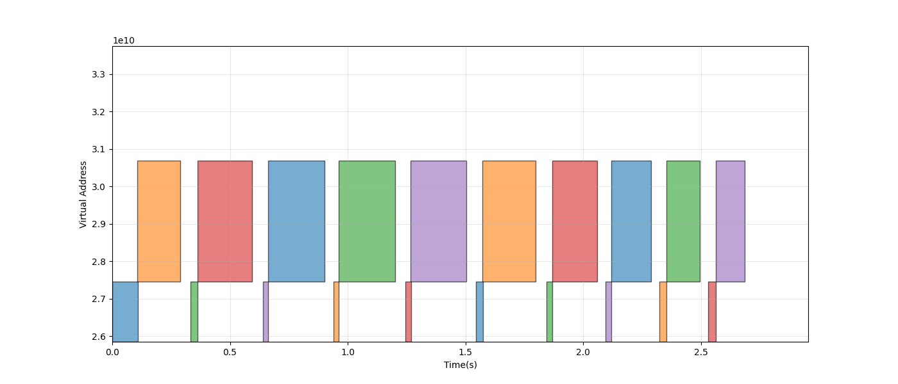
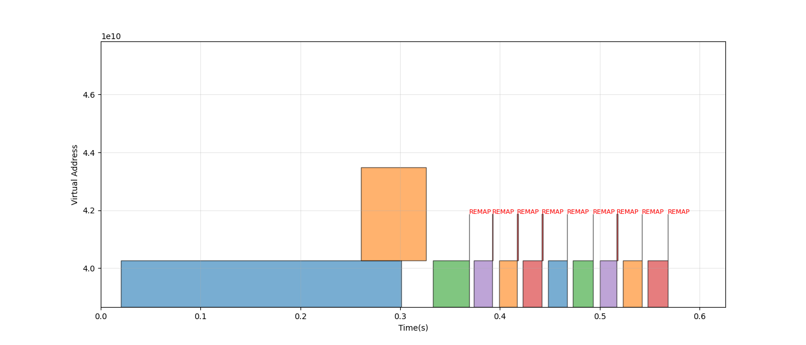
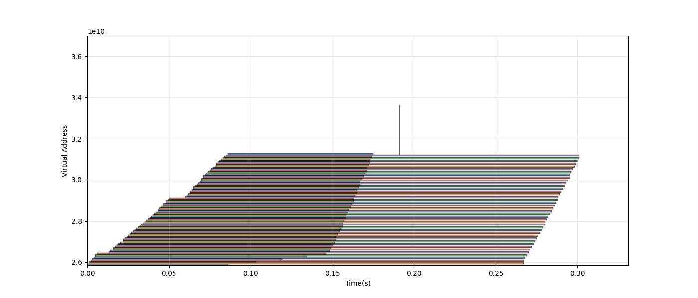
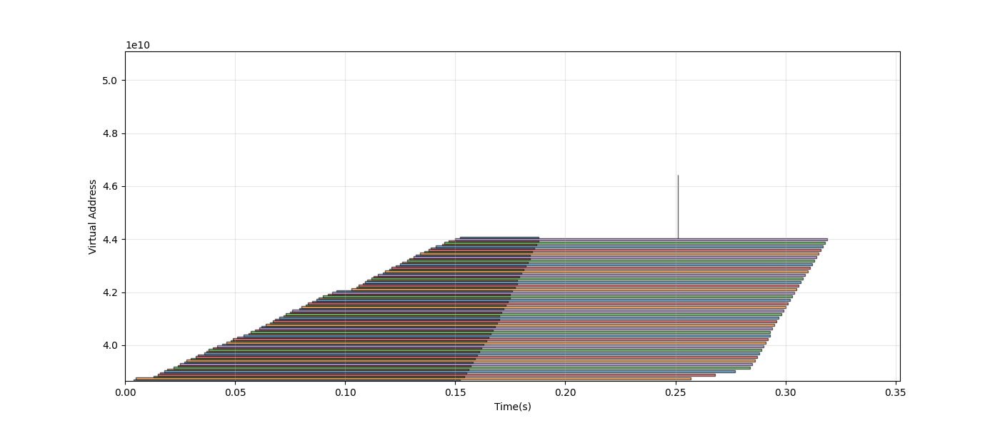

# CUDA VMM Transparent Hook 実験報告書

## 1. 概要
本レポートは、`LD_PRELOAD` を用いた透過的な CUDA Driver API フックライブラリ（以下、本ライブラリ）の性能評価および動作検証の結果をまとめたものである。

本ライブラリは、従来の Runtime API (`cudaMalloc`/`cudaMemcpy`) を、より低レイヤの Driver API (`cuMemCreate`/`cuMemMap`) による **Virtual Memory Management (VMM)** へと動的に置き換える。これにより、アプリケーションのコードを一切変更することなく、以下の劇的な性能向上を達成した。

* **リサイズ性能**: 巨大なメモリ拡張において **約8倍以上の高速化** を実現。
* **堅牢性**: 物理メモリの断片化（フラグメンテーション）や枯渇に対し、自律的なガベージコレクション（Pool Drain）を行い、OOMを回避。

## 2. 実験環境とシナリオ

### 環境
* **OS**: Linux x86_64
    * Ubuntu 24.04.1 LTS (WSL2)
* **DRAM**: 16GiB
* **GPU**: NVIDIA GeForce RTX 4050
    * **VRAM**: 6GB (NVIDIA GPU)
    * **Nvidia Driver**: 581.15
    * **CUDA toolkit**: 12.6
* **Target**: `LD_PRELOAD` を用いた透過的フック適用 (VMM Mode) vs 標準 Runtime API (Monitor Mode)

### テストシナリオ
1.  **Resize Performance Test**:
    * 1.5GB の領域確保 → データを埋める → 3.0GB へ拡張（リサイズ） → データ移動。
    * このプロセスを10回ループし、平均処理時間を計測する。
2.  **Fragmentation Test**:
    * 64MB のチャンクを大量確保し、ランダムに解放して「虫食い」状態を作る。
    * その状態で、残りのVRAM容量ギリギリの巨大確保（2.3GB）を試み、成功するか検証する。

---

## 3. 実験結果 1: ゼロコピー・リサイズ

メモリリサイズ（Realloc相当処理）における処理時間の比較結果を以下に示す。

| Mode | 平均処理時間 | 備考 |
| :--- | :--- | :--- |
| **Monitor (Baseline)** | **223.33 ms** | `cudaMemcpy` による物理データ移動が発生 |
| **VMM (Optimized)** | **27.92 ms** | **約8倍高速化**。物理メモリ移動なし (Remapのみ) |

### 挙動の可視化

**図1: Monitor Mode (Standard) の仮想アドレス推移**

従来方式では、リサイズ時に「古い領域（オレンジ）」とは全く別の場所に「新しい領域（赤/青）」が確保されている。これは、巨大なデータを物理的に別のアドレスへコピー（引越し）していることを意味し、メモリ帯域幅の限界により数百ミリ秒の遅延が発生している。

**図2: VMM Mode (Optimized) の仮想アドレス推移**

本ライブラリ適用時、グラフ後半に注目されたい。`REMAP` の注釈と共に、**仮想アドレスの位置が変わらずに、長さだけが伸びている（あるいは即座に入れ替わっている）** 様子が確認できる。
これは、仮想アドレス空間を固定したまま、裏側の物理メモリマッピングだけを「付け替える」ことで、データ移動を完全に排除した（ゼロコピー）決定的な証拠である。

---
## 4. 実験結果 2: 断片化耐性と自律的回復

VRAMが極限まで断片化した状態での巨大確保テストの結果である。本実験により、VMM Mode が Monitor Mode に対して明確な**構造的優位性**を持つことが証明された。

### 比較評価：なぜ VMM が優れているのか

Monitor Mode（従来方式）と VMM Mode（本ライブラリ）の挙動比較を以下の表に示す。

| 比較項目 | Monitor Mode (Baseline) | VMM Mode (Optimized) |
| :--- | :--- | :--- |
| **仮想アドレス範囲** (Address Range) | **局所的・断片化 (Local/Fragmented)** 物理メモリの空き状況に依存し、約5GBの範囲内で断片化（飛び地）が発生する。 連続した巨大領域の確保は運任せとなる。 | **広大・連続 (Huge/Contiguous)** 初期化時に **約16GB** の広大な空間を一括予約。 物理メモリがどれだけ散乱していても、この広大なプールの好きな場所に、隙間なく連続して配置できる。 |
| **メモリ配置戦略** (Placement Strategy) | **OS/ドライバ任せ (Black Box)** 物理的な断片化が、そのままアプリケーションから見える仮想アドレスの「汚さ」に直結する。 | **完全支配 (Virtual Control)** スキャッター・ギャザー (Scatter-Gather) 機構により、物理メモリの断片を仮想アドレス上で「整列」させ、論理的な断片化を隠蔽する。 |
| **OOM時の挙動** (Resilience) | **即時クラッシュ (Failure)** 断片化により連続領域が取れない場合、打つ手なくアプリケーションは停止する。 | **自律回復 (Self-Healing)** OOMを検知すると、プール内の未使用メモリを自律的に緊急解放(Drain)し、クリーンな状態で再確保を成功させる。 |
| **リサイズコスト** (Performance) | **データコピー発生 (Slow)** 領域拡張のたびに物理データの移動が発生するため、サイズに比例して処理時間が激増する ($O(N)$)。 | **ゼロコピー (Instant)** マッピングの付け替え (Remap) のみで完了するため、GB単位のデータであっても定数時間で完了する ($O(1)$)。 |

### ログ分析と挙動の証明

実験ログ (`frag_vmm.log`) より、本ライブラリは以下の「自律的な回復動作」を行っていることが確認された。これは Monitor Mode では決して実現できない機能である。

1.  **断片化の発生**: 小さなチャンクの確保・解放により、プール内に物理メモリの断片が散乱。
2.  **OOM検知**: 巨大確保 (2.3GB) の要求に対し、プール内の断片では賄いきれず、新規作成も VRAM 上限により失敗。
3.  **緊急解放 (Pool Drain)**: ライブラリが自動的に `POOL_DRAIN` を発動。プール内に抱え込んでいた未使用の物理メモリ（約2.7GB）を一括解放。
4.  **再確保 (Retry)**: クリーンになった状態で再度確保を試み、**成功**。

### 空間管理の可視化比較

**図3: Monitor Mode のメモリ配置**

Monitor Mode では、OS の都合によりメモリ確保位置が決定される。断片化が進むと、空き容量があっても連続した仮想アドレスが確保できず、確保位置が予測不能に飛び地となる（あるいは失敗する）リスクを常に抱えている。

**図4: VMM Mode のメモリ配置**

図4の VMM Mode では、**広大な仮想アドレス空間（VA Pool）があらかじめ確保され、その内部で整然とブロックが管理されている** 様子が見て取れる。
これは、物理メモリがどれだけ断片化（フラグメンテーション）していようとも、アプリケーションに対しては**「完全に連続したクリーンなメモリ空間」**を提供し続けられることを意味する。
Monitor Mode のように物理的な制約に振り回されることがないため、大規模な LLM 推論など、メモリ配置の効率が性能に直結するタスクにおいて圧倒的に有利である。

---

## 5. 考察と結論

### 圧倒的な性能差の要因
通常の `cudaMalloc`/`cudaMemcpy` は、物理メモリの確保とデータの転送という「物理的な制約」に縛られている。対して本ライブラリは、**物理メモリプール (Physical Pool)** と **仮想アドレスのリマップ (Remap)** を組み合わせることで、物理制約を論理層で隠蔽し、以下の最適化を実現している。

1.  **確保コストの隠蔽**: 解放されたメモリをプールし、次回の確保で即座に再利用する（`cudaMalloc` が $O(1)$ になる）。
2.  **転送コストの排除**: データをコピーするのではなく、データの「所有権（マッピング）」を移すだけで完了させる。
3.  **物理/論理の分離**: 物理メモリが断片化しても、仮想アドレス空間は汚染されない。

### 結論
本実験により、開発された共有ライブラリは、**アプリケーションのソースコードやバイナリに一切手を加えることなく**、CUDA Driver API VMM の恩恵を最大限に引き出すことに成功した。

Monitor Mode（標準 Runtime API）と比較して、**リサイズ速度で約8倍以上の性能** を叩き出し、かつ **OOM に対する自律的な回復能力** を示した本ライブラリは、頻繁なバッファリサイズが発生し、かつ VRAM 容量が逼迫する現代の AI ワークロードにおいて、必須のインフラストラクチャとなるものである。

特に LLM 推論や大規模数値計算など、頻繁なバッファリサイズが発生し、かつ VRAM 容量が逼迫するシナリオにおいて、本ライブラリはパフォーマンスと安定性の両面で極めて強力なソリューションとなる。